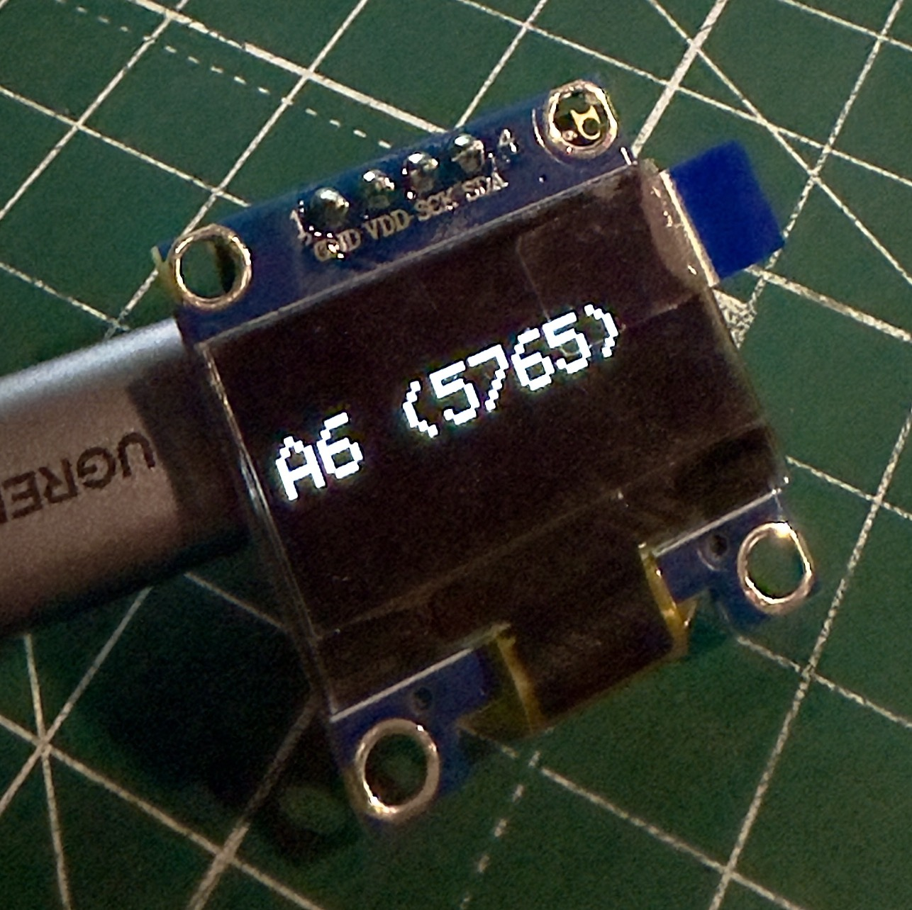

# ExpressLRS Backpack

## Fork notes (TX Backpack test stand)

This fork contains a small **ESP32-S3 test stand** firmware intended for validating **TX Backpack VTX channel updates** with an SSD1306 OLED + serial logs.

- PlatformIO env: `Test_Stand_ESP32S3_Backpack_via_UART`

- OLED I2C pins: `SDA=12`, `SCL=13`

---

The ExpressLRS Backpack adds ESP-NOW–based wireless communication between ExpressLRS TX modules and compatible FPV hardware, allowing for remote configuration, control, and telemetry exchange. Developed and maintained by **ExpressLRS LLC** and its passionate open source community, working together to advance
reliable, high-performance radio control technology.

## What is a "TX Backpack"?

Some of the ExpressLRS TX modules include an additional ESP8285 chip, which lets us communicate wirelessly with other ESP8285 enabled devices using a protocol called espnow. We call this chip the "TX-Backpack". The aim of the TX-Backpack is to allow wireless communication between ExpressLRS, and other FPV related devices for command and control, or for querying config.

## Sounds interesting... What type of FPV devices can it talk to?
 A prime use case is your video receiver module (or VRX). Currently there aren't many VRX modules that have an ESP8285 built in to allow them to communicate with ExpressLRS, so in most cases you need to add your own. A small ESP based receiver can be "piggybacked" onto your VRX module, which allows ExpressLRS to control the band and channel that your goggles are set to. We call this device the "VRX-Backpack". 

## Wow cool, so I'll be able to control the module via ELRS!? Which VRX modules does it work with?
The list of supported modules can be found on the wiki:
https://github.com/ExpressLRS/Backpack/wiki

## Great! I use one of the supported modules. How do I get a VRX-Backpack?
There are a few different options for both DIY or compatible off the shelf backpacks... check the wiki for the current list:
https://github.com/ExpressLRS/Backpack/wiki
